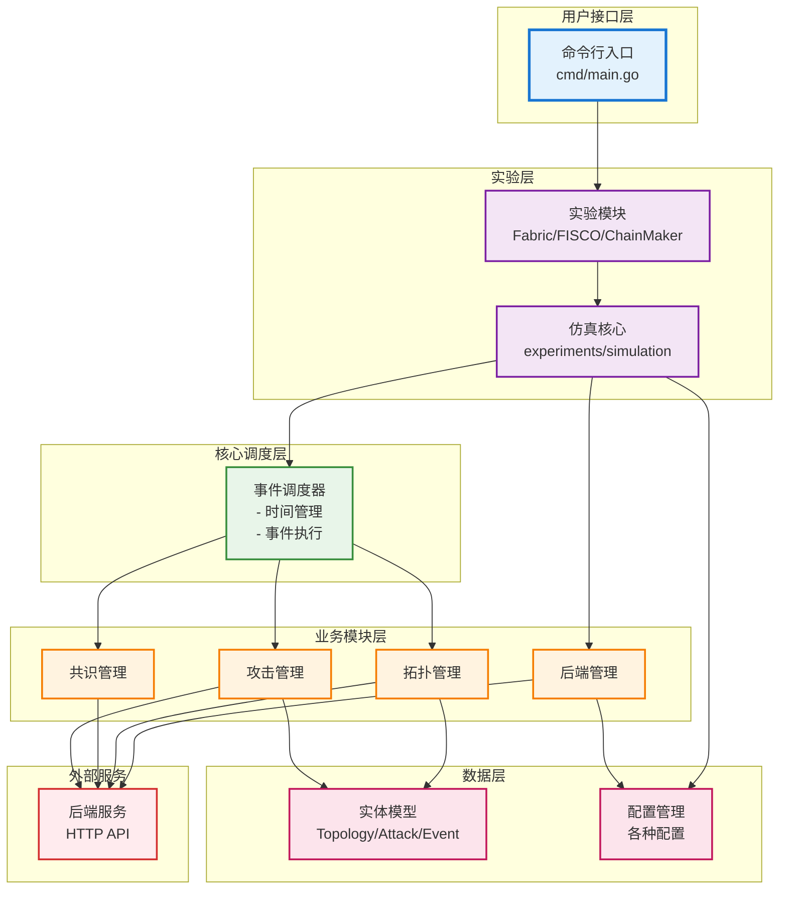
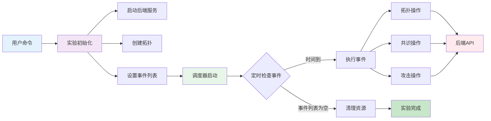
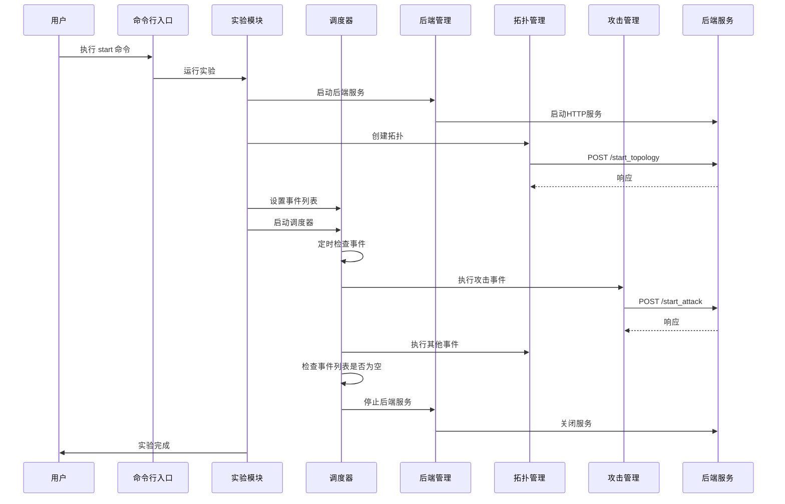

# Chain Simulation 项目架构图

## 简化版架构图



## 简化版数据流



### 简化版架构说明

#### 核心层级（6层）

1. **用户接口层**
   - 命令行入口，接收用户命令

2. **实验层**
   - 支持多种区块链实验（Fabric、FISCO BCOS、ChainMaker）
   - 仿真核心协调整个实验流程

3. **核心调度层**
   - 事件调度器：管理仿真时间轴，按时间执行事件

4. **业务模块层**
   - **后端管理**：启动/停止后端服务
   - **拓扑管理**：创建/销毁网络拓扑
   - **共识管理**：启动/停止共识协议
   - **攻击管理**：发起攻击操作

5. **数据层**
   - 实体模型：拓扑、攻击、事件等数据结构
   - 配置管理：各种系统配置

6. **外部服务层**
   - 后端HTTP服务，提供RESTful API

#### 主要流程

```
用户命令 
  → 实验初始化 
    → 启动后端服务 + 创建拓扑 + 设置事件
      → 调度器启动（定时检查并执行事件）
        → 业务模块执行（拓扑/共识/攻击）
          → 调用后端API
            → 实验完成，清理资源
```

## 详细版架构图

## 系统架构概览

```mermaid
graph TB
    subgraph "入口层 (Entry Layer)"
        CLI[cmd/main.go<br/>命令行入口]
        RootCmd[cmd/root<br/>根命令]
        StartCmd[cmd/start<br/>启动命令]
    end

    subgraph "实验层 (Experiment Layer)"
        SimCore[experiments/simulation.go<br/>仿真核心]
        FabricExp[experiments/fabric<br/>Fabric实验]
        FiscoExp[experiments/fiscobcos<br/>FISCO BCOS实验]
        ChainmakerExp[experiments/chainmaker<br/>ChainMaker实验]
    end

    subgraph "核心模块层 (Core Modules)"
        Scheduler[modules/scheduler<br/>事件调度器<br/>- 时间管理<br/>- 事件执行]
        BackendMgr[modules/backend_manager<br/>后端服务管理<br/>- 启动/停止后端]
        TopologyMgr[modules/topology_manager<br/>拓扑管理<br/>- 创建/销毁拓扑]
        ConsensusMgr[modules/consensus_manager<br/>共识管理<br/>- 启动/停止共识]
        AttackMgr[modules/attack_manager<br/>攻击管理<br/>- 发起攻击]
        ThreadMgr[modules/thread_manager<br/>线程管理<br/>- 协程同步]
        ChaincodeMgr[modules/chaincode_manager<br/>链码管理]
    end

    subgraph "实体层 (Entity Layer)"
        Topology[entities/Topology<br/>拓扑结构<br/>- Nodes<br/>- Links]
        Node[entities/Node<br/>节点信息]
        Link[entities/Link<br/>链路信息]
        Attack[entities/Attack<br/>攻击参数]
        Event[entities/Event<br/>事件定义]
        Parameter[entities/parameter<br/>参数配置]
    end

    subgraph "配置层 (Config Layer)"
        TopConfig[configs/top_config<br/>顶层配置]
        AttackConfig[configs/attack<br/>攻击配置]
        ConsensusConfig[configs/consensus<br/>共识配置]
        NetworkConfig[configs/network<br/>网络配置]
        PathConfig[configs/path<br/>路径配置]
        UrlConfig[configs/url<br/>URL配置]
    end

    subgraph "工具层 (Utils Layer)"
        FileUtils[utils/file<br/>文件操作<br/>- 读写<br/>- 修改]
        RequestUtils[utils/request<br/>HTTP请求]
        ExecuteUtils[utils/execute<br/>命令执行]
        DirUtils[utils/dir<br/>目录管理]
        SignalUtils[utils/signal<br/>信号处理]
    end

    subgraph "资源层 (Resource Layer)"
        ConfigYml[resources/configuration.yml<br/>配置文件]
        TopologyFiles[resources/topologies<br/>拓扑JSON文件]
    end

    subgraph "外部服务 (External Services)"
        BackendService[后端服务<br/>HTTP API]
    end

    %% 入口层连接
    CLI --> RootCmd
    RootCmd --> StartCmd
    StartCmd --> SimCore

    %% 实验层连接
    SimCore --> BackendMgr
    SimCore --> Scheduler
    SimCore --> ThreadMgr
    SimCore --> FileUtils
    FabricExp --> SimCore
    FiscoExp --> SimCore
    ChainmakerExp --> SimCore

    %% 核心模块连接
    Scheduler --> Event
    Scheduler --> ThreadMgr
    BackendMgr --> ThreadMgr
    BackendMgr --> DirUtils
    BackendMgr --> ExecuteUtils
    TopologyMgr --> Topology
    TopologyMgr --> RequestUtils
    ConsensusMgr --> RequestUtils
    AttackMgr --> Attack
    AttackMgr --> RequestUtils

    %% 实体层连接
    Topology --> Node
    Topology --> Link
    Topology --> FileUtils
    Event --> AttackMgr
    Event --> TopologyMgr
    Event --> ConsensusMgr

    %% 配置层连接
    TopConfig --> AttackConfig
    TopConfig --> ConsensusConfig
    TopConfig --> NetworkConfig
    TopConfig --> PathConfig
    TopConfig --> UrlConfig
    BackendMgr --> TopConfig
    TopologyMgr --> TopConfig
    ConsensusMgr --> TopConfig
    AttackMgr --> TopConfig

    %% 工具层连接
    FileUtils --> ConfigYml
    FileUtils --> TopologyFiles
    RequestUtils --> BackendService

    %% 样式
    classDef entryLayer fill:#e1f5ff,stroke:#01579b,stroke-width:2px
    classDef experimentLayer fill:#f3e5f5,stroke:#4a148c,stroke-width:2px
    classDef coreLayer fill:#e8f5e9,stroke:#1b5e20,stroke-width:2px
    classDef entityLayer fill:#fff3e0,stroke:#e65100,stroke-width:2px
    classDef configLayer fill:#fce4ec,stroke:#880e4f,stroke-width:2px
    classDef utilLayer fill:#f1f8e9,stroke:#33691e,stroke-width:2px
    classDef resourceLayer fill:#e0f2f1,stroke:#004d40,stroke-width:2px
    classDef externalLayer fill:#ffebee,stroke:#b71c1c,stroke-width:2px

    class CLI,RootCmd,StartCmd entryLayer
    class SimCore,FabricExp,FiscoExp,ChainmakerExp experimentLayer
    class Scheduler,BackendMgr,TopologyMgr,ConsensusMgr,AttackMgr,ThreadMgr,ChaincodeMgr coreLayer
    class Topology,Node,Link,Attack,Event,Parameter entityLayer
    class TopConfig,AttackConfig,ConsensusConfig,NetworkConfig,PathConfig,UrlConfig configLayer
    class FileUtils,RequestUtils,ExecuteUtils,DirUtils,SignalUtils utilLayer
    class ConfigYml,TopologyFiles resourceLayer
    class BackendService externalLayer
```



## 数据流图



## 模块职责说明

### 入口层 (Entry Layer)
- **cmd/main.go**: 程序入口，初始化命令行结构
- **cmd/root**: 根命令定义
- **cmd/start**: 启动命令，执行具体实验

### 实验层 (Experiment Layer)
- **experiments/simulation.go**: 仿真核心逻辑，协调各个模块
- **experiments/fabric**: Hyperledger Fabric 相关实验
- **experiments/fiscobcos**: FISCO BCOS 相关实验（原版、黑名单版、Prepare缓存版）
- **experiments/chainmaker**: ChainMaker 相关实验（原版、黑名单版、小Tmin版）

### 核心模块层 (Core Modules)
- **scheduler**: 事件驱动的调度器，管理仿真时间轴和事件执行
- **backend_manager**: 管理后端服务的启动和停止
- **topology_manager**: 管理区块链网络拓扑的创建和销毁
- **consensus_manager**: 管理共识协议的启动和停止
- **attack_manager**: 管理攻击的发起
- **thread_manager**: 管理协程的生命周期和同步
- **chaincode_manager**: 管理链码的部署和执行

### 实体层 (Entity Layer)
- **Topology**: 网络拓扑结构（节点、链路）
- **Node**: 节点信息
- **Link**: 链路信息
- **Attack**: 攻击参数定义
- **Event**: 事件定义（包含处理函数）

### 配置层 (Config Layer)
- 统一的配置管理，包括攻击、共识、网络、路径、URL等配置

### 工具层 (Utils Layer)
- 文件操作、HTTP请求、命令执行等工具函数

### 资源层 (Resource Layer)
- 配置文件和拓扑JSON文件

