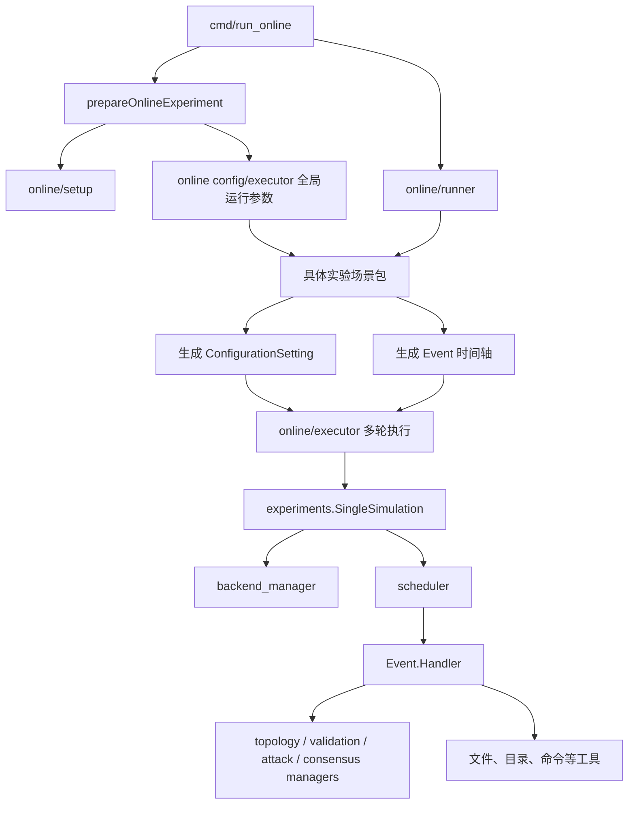

# Experiments 模块组织架构说明

本文基于当前仓库代码梳理 `experiments` 模块的目录结构、核心抽象、执行流程和扩展方式。当前 `experiments` 下共有 70 个 Go 文件，整体采用“实验定义生成事件列表，通用仿真器按时间调度事件”的架构。

## 1. 总体结构

```text
experiments/
├── simulation.go                         # 所有实验共用的单轮仿真入口
├── consortium_chain/                     # 联盟链实验
│   ├── fabric/                           # Fabric 场景
│   ├── fiscobcos/                        # FISCO BCOS 场景
│   └── chainmaker/                       # ChainMaker 场景
├── path_validation/                      # 离线路径验证实验
│   ├── file_transmission/                # 单播文件传输
│   ├── batch_transmission/               # 单播批量消息传输
│   ├── multicast_file_transmission/      # 多播文件传输
│   └── multicast_batch_transmission/     # 多播批量消息传输
└── online/                               # SecPathMAB 在线实验矩阵
    ├── config/                           # 参数组合、重复次数、结果目录
    ├── setup/                            # 配置加载和拓扑生成
    ├── executor/                         # 多轮执行和恶意节点调度
    ├── runner/                           # 场景注册与批量运行入口
    ├── throughput/                       # 吞吐量实验
    ├── frequency_0_1s/                   # 0.1 秒更新频率下的 12 个场景
    ├── frequency_0_5s/                   # 0.5 秒更新频率下的 12 个场景
    └── frequency_1s/                     # 1 秒更新频率下的 12 个场景
```

模块可以分成三层：

| 层次 | 主要代码 | 职责 |
| --- | --- | --- |
| 实验入口层 | `cmd/run_online`、`online/runner`、各 `*Experiment()` | 选择需要运行的实验族或具体场景 |
| 场景定义层 | `consortium_chain`、`path_validation` 下的场景文件 | 构造配置组合和按时间排列的事件列表 |
| 通用执行层 | `experiments/simulation.go`、`modules/scheduler` | 修改配置、启动后端、按相对时间触发事件、清理环境 |

## 2. 核心抽象

### 2.1 ConfigurationSetting

`entities.ConfigurationSetting` 表示一轮仿真的配置：

```go
type ConfigurationSetting struct {
    Index   int
    Mapping map[string]string
}
```

`Mapping` 有两种用途：

1. `SingleSimulation` 将它写入 `configuration.yml`。
2. 场景生成器直接读取其中的值，例如 `per_link_delay`、`number_of_packets_per_link`、`experiment_name` 和 `server_index`。

它是一个字符串键值表，因此扩展方便，但字段名、类型转换和必填约束只能在运行时检查。

### 2.2 Event

`entities.Event` 是实验调度的最小单位：

```go
type Event struct {
    StartTime time.Duration
    Action    types.ActionType
    Handler   func() error
}
```

- `StartTime`：相对于当前仿真启动时刻的触发时间，不是事件间隔。
- `Action`：事件的语义标签，主要用于日志和进度显示。
- `Handler`：真正执行拓扑、客户端、服务端、攻击、结果复制等操作的函数。

常见 Action 包括：

- 环境生命周期：`StartTopology`、`StopTopology`、`WaitTopologyRemove`。
- 联盟链：`StartInstallChaincode`、`StartConsensus`、`StopConsensus`、`StartAttack`。
- 路径验证：`StartServer`、`StartClient`、`ModifyBloomFilter`。
- 在线算法：`InitOsmd`、`StartOsmd`、`ChangeCorruptRatio`、`SynchronizeTimestamp`。
- 辅助处理：`InstallKernelModule`、`RemoveKernelModule`、`ClearKernelLog`、`ResultHandling`。

### 2.3 SingleSimulation

`experiments.SingleSimulation(configurationSetting, events)` 是所有实验最终汇合的单轮执行入口。它的流程是：

1. 根据 `ConfigurationSetting.Mapping` 修改 YAML 配置。
2. 使用全局 `experimentIndex` 启动 backend 服务。
3. 同步调用 `scheduler.Run(events)` 运行本轮相对时间轴。
4. Scheduler 返回后停止 backend，并等待其子进程退出。
5. 汇总调度和停止阶段的错误，然后递增 `experimentIndex`。

### 2.4 Scheduler

每次 `scheduler.Run` 都创建独立 Scheduler：

- 复制事件列表并按照 `StartTime` 稳定排序。
- 以 `Run` 开始时刻为零点，用 timer 等待下一个事件。
- 到期后按顺序调用 `Handler()`。
- 已调用的事件进入 `ExecutedEvents`，进度条同步增加。
- 全部事件处理后，通过 `errors.Join` 汇总 Handler 错误并返回。

因此，场景文件的核心工作不是直接执行实验，而是构造一条相对时间轴。

## 3. 端到端调用关系



联盟链和非 online 的路径验证实验通常没有 `runner/config/executor` 这一层，而是由自己的 `*Experiment()` 直接调用 `SingleSimulation`。

## 4. 联盟链实验

`consortium_chain` 按区块链平台分包，共 7 个场景文件：

| 平台 | 场景 | 主要差异 |
| --- | --- | --- |
| Fabric | `fabric.go` | 包含安装 Chaincode，并执行两次攻击事件 |
| FISCO BCOS | original、blacklist、prepare-cache | 基准、防黑名单、防预准备缓存 |
| ChainMaker | original、blacklist、small-tmin | 基准、防黑名单、较小 TMin |

这些文件通常直接声明一个全局 `[]*entities.Event`。典型时间轴为：

```text
启动拓扑
  → 安装 Chaincode（仅 Fabric）
  → 启动共识
  → 发起一次或多次攻击
  → 停止共识
  → 停止拓扑
  → 等待拓扑清理
```

每个场景末尾的 `*Experiment()` 构造一个或多个空 `ConfigurationSetting`，然后复用同一个静态事件列表调用 `SingleSimulation`。

目前 `cmd/main.go` 只注册了 `run-online` 命令，这些联盟链实验函数没有接入当前 CLI，需要由其他代码直接调用或后续增加命令入口。

## 5. 路径验证的非 online 实验

这一部分按照“单播/多播”和“文件/批量消息”两组维度组织：

| 目录 | 文件数 | 协议/算法 |
| --- | ---: | --- |
| `file_transmission` | 4 | EPIC、FAST_SELIR 512、FAST_SELIR 1024、ICING/OPT |
| `batch_transmission` | 3 | EPIC、FAST_SELIR、ICING/OPT |
| `multicast_file_transmission` | 2 | Multicast LiP、Multicast OPT |
| `multicast_batch_transmission` | 2 | Multicast LiP、Multicast OPT |

与联盟链的静态事件数组不同，这些文件普遍提供 `Generate*Events()`。生成器会遍历协议、跳数、目的节点或结果文件，并动态追加事件。

常见单播文件时间轴：

```text
启动拓扑
  → 可选：调整 Bloom Filter
  → 启动服务端
  → 启动客户端
  → 停止拓扑
  → 等待清理
```

常见批量消息时间轴：

```text
启动拓扑
  → 清空内核日志
  → 可选：调整 Bloom Filter
  → 启动服务端
  → 启动客户端
  → 复制/处理结果
  → 停止拓扑
  → 等待清理
```

部分实验通过 `breakpoint_awareness` 查询已有结果，生成事件时直接跳过已经完成的参数组合。这是当前模块的断点续跑机制之一。

## 6. Online 实验

### 6.1 场景矩阵

online 的主体是 36 个高度相似的场景包，由三组维度做笛卡尔组合：

| 维度 | 可选值 |
| --- | --- |
| 算法策略 | `fixed_batch`、`dynamic_batch`、`path_mab` |
| 恶意参数更新频率 | `frequency_0_1s`、`frequency_0_5s`、`frequency_1s` |
| 单链路延迟 | `delay_1_25ms`、`delay_2_5ms`、`delay_5ms`、`delay_10ms` |

计算方式为 `3 × 3 × 4 = 36`。目录名表达参数组合，文件内部再用包级变量保存学习率、目标节点、消息大小、OSMD 策略等具体参数。

此外，`online/throughput` 下还有：

- `fixed_batch`：按照 hop、segment、batch size 和重复次数生成吞吐量配置。
- `opt`：按照 hop、segment 和重复次数生成 OPT 吞吐量配置。

### 6.2 Online 支撑包

#### config

`online/config` 负责：

- 生成不同 batch size 的 `ConfigurationSetting`。
- 控制每组配置的重复次数。
- 给重复运行追加 `run_N` 结果目录和 `experiment_run_index`。
- 计算结果目录，并通过目录是否非空判断是否跳过已有结果。

#### setup

`online/setup` 负责：

- 初始化顶层配置。
- 根据线性或非线性拓扑类型生成 OSMD 拓扑描述。
- 生成 backend 使用的实际拓扑 JSON。
- 根据当前配置刷新可选恶意节点集合。

#### executor

`online/executor` 负责横跨多个场景的执行逻辑：

- `RunDifferentBatchSizeExperiments`：遍历配置、重复运行、跳过已有结果、调用事件生成器和 `SingleSimulation`。
- 恶意节点调度模式：`random`、`sequential`、`none`。
- 根据 hop 分组生成候选恶意节点，校验每轮恶意节点数量。
- 使用固定且可随 `runIndex` 变化的随机种子，保证实验可复现。
- 将恶意比例变化转换为定时的 `SetScheduledMaliciousParams` 请求。

#### runner

`online/runner` 提供四个聚合入口：

- `RunAllFixedBatchExperiments`
- `RunAllDynamicBatchExperiments`
- `RunAllPathMabExperiments`
- `RunAllThroughputExperiments`

runner 不是自动发现目录，而是显式导入场景包并维护 `name + func() error` 列表。当前大部分场景被注释，实际启用的是少量指定组合。因此，“目录中存在场景”不等于“执行 run-online 时会运行场景”。

### 6.3 Online 典型事件时间轴

```text
安装内核模块
  → 启动 SecPathMAB 拓扑
  → 初始化 OSMD 参数
  → 下发恶意节点比例变化计划
  → 同步所有节点时间戳
  → 启动 OSMD
  → 等待实验窗口
  → 复制输出结果
  → 停止拓扑
  → 卸载内核模块
  → 等待环境清理
```

配置维度主要通过 `ConfigurationSetting.Mapping` 注入；不随配置组合变化的值则保存在场景包的包级变量中。

### 6.4 CLI 入口

当前可执行入口是：

```text
main
└── run-online
    ├── fixed-batch
    ├── dynamic-batch
    ├── path-mab
    └── throughput
```

前三类命令支持：

- `--runs`：每个配置重复次数。
- `--corrupt-ratio-mode`：`random`、`sequential` 或 `none`。
- `--bad-node-count`：随机模式下每轮选取的恶意节点数量。

吞吐量命令支持 `--runs` 和 `--corrupt-ratio-mode`。

## 7. 新增实验时的落点

### 新增普通路径验证实验

1. 在对应的 transmission 目录新增或扩展场景文件。
2. 编写 `Generate*Events()`，使用累计的 `currentTime` 构造相对时间轴。
3. 编写 `*Experiment()`，准备 `ConfigurationSetting` 并调用 `SingleSimulation`。
4. 如果需要从 CLI 运行，再增加相应命令注册。

### 新增 Online 参数组合

当前结构下需要：

1. 在对应 frequency 下新增场景包。
2. 设置 `resultScenarioPrefix`，保证结果目录唯一。
3. 实现事件生成函数。
4. 使用 `online/executor.RunDifferentBatchSizeExperiments` 复用多轮执行逻辑。
5. 在对应 `online/runner` 中显式导入并注册函数。

### 新增一种事件动作

1. 在 `entities/proto/action.proto` 中增加 `ActionType` 并重新生成 protobuf 文件。
2. 在相关 manager 或 utility 中实现动作。
3. 在场景生成器中创建带有 `StartTime`、`Action` 和 `Handler` 的 Event。

Scheduler 不按 Action 类型分派；真正的行为完全由 `Handler` 决定。

## 8. 当前架构的主要维护风险

### 8.1 Online 场景重复度高

36 个矩阵场景大多复制了完整的事件生成流程，只改变策略、频率、延迟、学习率或目标节点。修复公共流程时需要同步修改大量文件，容易产生命名和行为不一致。

更合适的长期方向是定义一个 `OnlineScenario` 配置结构体，用统一生成器展开策略、频率和延迟矩阵。

### 8.2 Runner 依靠注释手工启停

当前 runner 通过修改 import 和注释列表控制运行集合。它不利于批量选择、自动枚举和从 CLI 精确过滤场景。可以考虑建立集中式场景注册表，并让 CLI 接收 strategy、frequency、delay 过滤条件。

### 8.3 Handler 的完成语义不统一

许多 `Handler` 内部启动 goroutine 后立即返回 `nil`。Scheduler 记录的是“动作已发起”，不是“动作已完成”；即使 `scheduler.Run` 已返回，也不代表这些内部 goroutine 已完成。后台 goroutine 中的错误通常只打印日志，无法反馈给 Scheduler 或 `SingleSimulation`。

如果事件之间存在严格依赖，建议让 Handler 同步完成，或返回可被统一等待和收集错误的任务句柄。

### 8.4 长时间同步 Handler 会推迟后续事件

Scheduler 使用精确 timer 等待 `StartTime`，但 Handler 仍按顺序同步调用。若某个 Handler 本身长时间阻塞，后续事件会在它返回后补执行，因此场景应明确选择同步完成还是自行启动后台任务。

### 8.5 全局可变状态较多

当前仍依赖全局 `experimentIndex`、`TopologyStartParamsInstance`、online 运行参数和恶意节点候选集合。串行执行是默认假设，并发运行多个实验仍可能互相影响。

### 8.6 环境路径硬编码

场景和 online 配置中多处直接使用 `/home/zhf/Projects/emulator/...`、`/var/log/kern.log`、固定端口和节点命名。这使实验定义与特定 Linux 环境强耦合，迁移机器时需要修改源码。

建议逐步把路径、端口和节点规则收敛到顶层配置或专门的实验环境配置中。

## 9. 一句话总结

`experiments` 当前是一个以 `Event` 时间轴为中心的实验编排层：场景包负责“生成什么事件以及何时发生”，`SingleSimulation + Scheduler` 负责“启动环境并按时间触发”，各 manager 负责“把事件转换为具体系统操作”。现阶段最大优点是场景直观，最大成本是 online 参数矩阵产生的大量重复代码和异步事件缺少统一完成语义。
