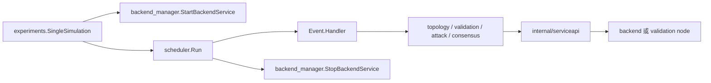

# Modules 目录说明

`modules` 是实验编排层与底层 emulator/backend 之间的能力层。实验代码只描述“什么时候做什么”，这里负责把动作转换为进程操作、HTTP 请求、事件调度或算法计算。

## 目录结构

```text
modules/
├── internal/
│   └── serviceapi/                 # 统一构造服务 URL 并发送 HTTP POST
│
├── backend_manager/                # backend 子进程的启动、停止和等待
├── scheduler/                      # 按 Event.StartTime 运行事件及展示进度
│   ├── scheduler.go
│   └── progress.go
│
├── topology_manager/               # 启停拓扑，保存最近一次拓扑启动参数
├── validation_manager/             # 验证节点 HTTP 操作
│   ├── endpoints.go                # endpoint 常量和节点请求公共逻辑
│   ├── traffic.go                  # StartClient / StartServer
│   ├── osmd.go                     # OSMD、恶意参数计划、时间同步
│   └── node_configuration.go       # Bloom Filter、Session Table 配置
├── attack_manager/                 # 启动攻击
├── consensus_manager/              # 启停共识压测
├── chaincode_manager/              # 安装 Chaincode
│
├── sec_path_mab_topology_generator/# 生成线性、非线性和 backend 拓扑
├── fast_selir/                     # FAST_SELIR Bloom Filter 位数计算
└── breakpoint_awareness/           # 已有实验结果查询/断点跳过
```

目录可以按职责理解为四组：

| 分组 | 包 | 作用 |
| --- | --- | --- |
| 运行时编排 | `backend_manager`、`scheduler` | 管理一轮实验的进程和时间轴 |
| 系统适配器 | `topology_manager`、`validation_manager`、`attack_manager`、`consensus_manager`、`chaincode_manager` | 把领域动作转换为 backend API 请求 |
| 领域辅助 | `sec_path_mab_topology_generator`、`fast_selir` | 生成拓扑或计算协议参数 |
| 结果辅助 | `breakpoint_awareness` | 判断实验结果是否已经存在 |

`internal/serviceapi` 只允许 `modules` 内部包引用，用来避免每个 manager 重复拼接地址、端口和 HTTP 错误。

## 一轮实验的执行逻辑



实际顺序为：

1. `SingleSimulation` 修改本轮配置。
2. `backend_manager` 启动 backend 子进程。
3. `scheduler.Run` 复制并稳定排序事件列表。
4. Scheduler 以调用 `Run` 的时刻为零点，等待每个 `Event.StartTime`。
5. 到期后调用 `Event.Handler`，记录执行结果并更新进度条。
6. 所有 Handler 调用完成后，Scheduler 汇总并返回错误。
7. `backend_manager` 取消 backend context，并等待子进程真正退出。

## HTTP 适配器逻辑

系统适配器不再各自重复以下代码：

```text
读取 TopConfigInstance
  → 计算 backend 或 validation node 端口
  → 拼接 URL
  → PostJson
  → 包装 endpoint 和操作错误
```

该流程统一放在 `internal/serviceapi`：

- `PostBackend`：请求主 backend 端口。
- `PostBackendWithPortOffset`：请求相对于 backend 的端口，例如攻击节点。
- `PostValidationNode`：按照 `ValidationNodePort + nodeIndex` 请求验证节点。

各 manager 只保留领域语义和请求体构造。例如 `validation_manager.StartClient` 只需要说明节点、endpoint 和 `entities.StartClient` 参数。

## 为什么仍保留 manager 包名

当前大量实验代码已经依赖 `modules/*_manager` import 路径。此次整理保留这些路径，避免目录重命名扩散到正在调整的 `experiments`。包内部已经移除无状态的空 `Manager` 结构体和 `Instance.Start()` 二次转发。

真正需要状态的模块仍保留结构体：

- `BackendManager` 持有正在运行的命令、取消函数和等待状态。
- `Scheduler` 持有单次运行的待执行/已执行事件和进度条；每次 `scheduler.Run` 创建独立实例，不共享全局运行状态。

## 模块边界约定

后续新增或修改模块时建议遵循：

1. 实验参数和时间顺序放在 `experiments`，不要放进 manager。
2. backend/节点 endpoint 调用放在对应 manager，并复用 `internal/serviceapi`。
3. 只有确实需要生命周期状态时才定义 Manager 结构体。
4. 一个文件聚焦一个领域，例如 traffic、OSMD、节点配置。
5. 错误使用 `%w` 向上传递，不在中间层只打印后继续。
6. 后台进程必须有明确的 owner、停止方法和等待语义。

## 仍可继续改进的部分

- `breakpoint_awareness.GetAlreadyCaclulatedFileTransmissionResult` 存在历史拼写问题，可以在调用方稳定后统一更名。
- 部分 Event Handler 自己启动 goroutine 并立即返回；Scheduler 只能保证 Handler 已调用，不能保证这些内部任务已经完成。
- `utils/request.PostJson` 每次请求都创建 Resty client，也没有把非 2xx 状态转换成错误，可在 HTTP 层继续收敛。
